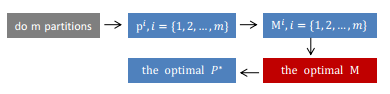

# The Core Code of Bregmanian Consensus Clustering

## Problem Statement

In this study, we relate each data partition$p^i$to a connectivity matrix.$M^i$ Thus, there is also a connectivity matrix $M$ corresponding to the final optimal consensus partition $P^*$. As the connectivity matrix can also be seen as a data similarity matrix, the final data clusters can be discovered by running a few similarity-based clustering algorithms on $M$. The ideas for solving this problem are shown in the following figure.



## Algorithms

There are four Bregmannian consensus clustering algorithms, which include Euclidean Distance, Exponential Distance,Kullback-Leibler Distance.The organization structure of our algorithm is shown in the following and the details of  our algorithms can be seen in the paper.

​	|---algorithm1(Unweighted Bregmannian Consensus Clustering,UBCC)

​	|---algorigthm2(Weight Bregmannian Consensus Clustering,WBCC)

​	|	|---EuWBCC

​	|	|---expWBCC

​	|	|---KLWBCC

​	|---algorigthm3(Unweight Bregman Consensus Clustering With 	Constraints,UBCCC)

​	|---algorigthm4(Weight Bregmannian Consensus Clustering With Constraints,WBCCC)

​	|	|---SSKLWBCC

​	|	|---SSEuWBCC

​	|	|---SSexpWBCC

## Requirements

Before starting to implement the consensus clustering algorithm, you need to prepare the Python3 environment with some packages, such as, cvxopt, numpy, sklearn, pandas, random, scipy,matplotlib.

## Running

It can be run like:

```optimal_M = eWBCC(partitions,precision,tradeoff)```  